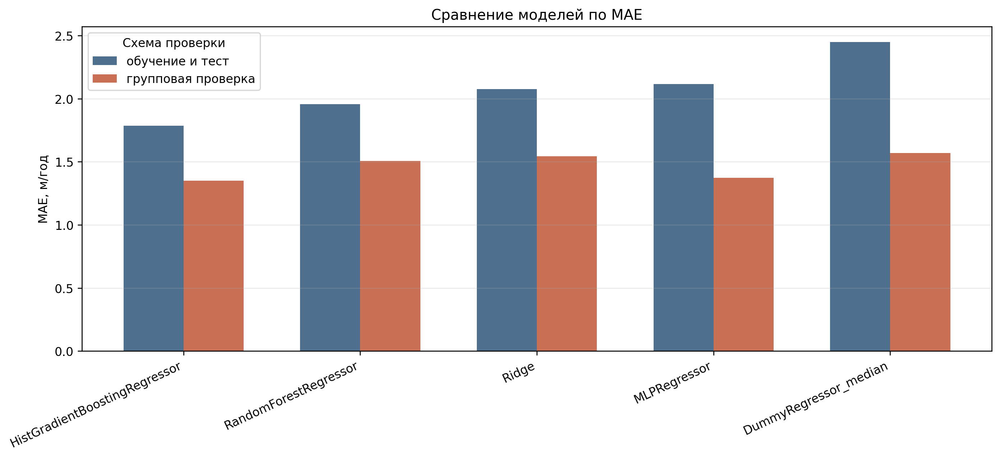
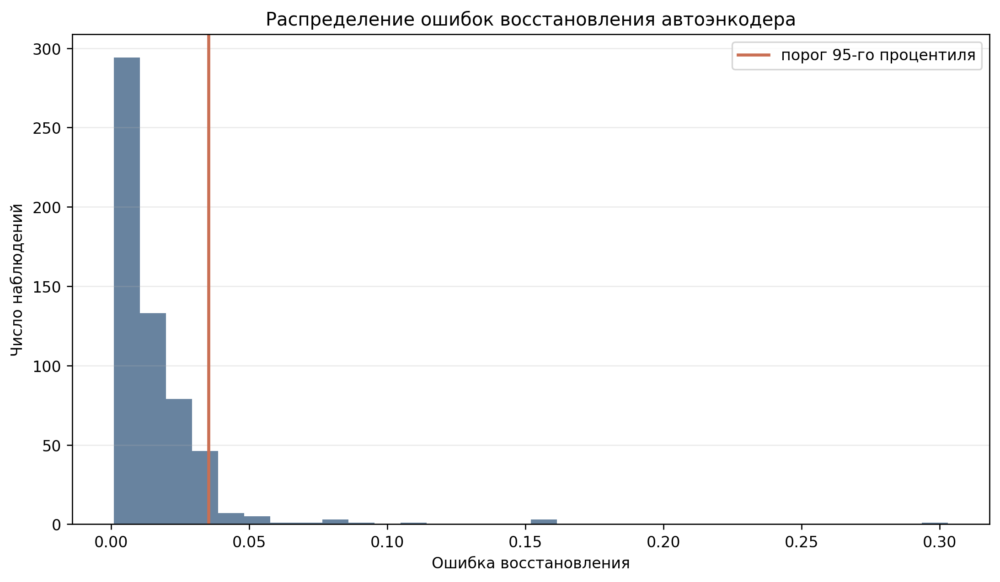
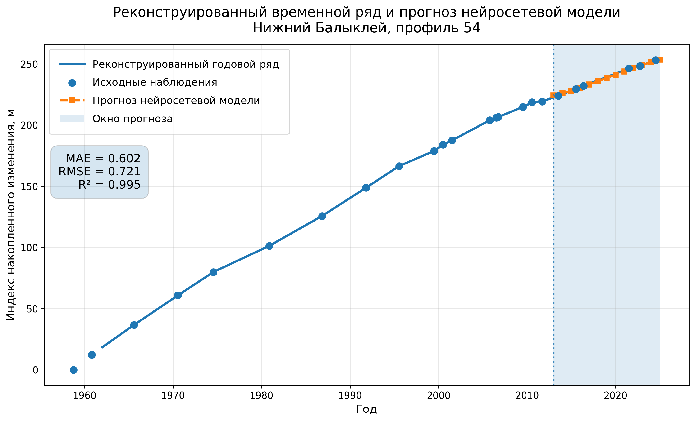

# Применение нейросетей для статистической обработки информации

Учебно-исследовательский проект, выполненный в рамках курсовой работы по теме **«Применение нейросетей для статистической обработки информации»**.

В качестве прикладной задачи использованы данные наблюдений за изменением береговой линии Волгоградского водохранилища. Исходные материалы были предоставлены для выполнения курсовой работы в рамках исследовательского проекта, связанного с последующей дипломной работой.

Цель проекта — подготовить неоднородные исходные данные к анализу и проверить возможности статистических и нейросетевых методов при работе с ними.

## Что сделано

В проекте реализована последовательная обработка данных:

1. разбор и нормализация исходных таблиц;
2. контроль качества и формирование аналитического набора данных;
3. расчёт интервальных показателей изменения береговой линии;
4. исследовательский анализ данных;
5. сравнение базовых регрессионных, ансамблевых и нейросетевых моделей;
6. применение автоэнкодера для поиска нетипичных наблюдений;
7. анализ различий между отдельными участками и профилями;
8. экспериментальное построение нейросетевого прогноза на реконструированном временном ряду.

## Нейросетевые методы

Нейросетевые методы использовались в проекте в нескольких ролях:

* `MLPRegressor` — как модель регрессии для сравнения с более простыми и ансамблевыми алгоритмами;
* автоэнкодер — как инструмент поиска наблюдений с нетипичным сочетанием признаков;
* MLP-модель — для экспериментального прогноза реконструированного временного ряда отдельного берегового профиля.

Нейросетевые модели рассматриваются как часть сравнительного и исследовательского анализа, а не как заведомо лучший метод для данного набора данных.

## Основные результаты

В базовом эксперименте сравнивались `DummyRegressor`, `Ridge`, `RandomForestRegressor`, `HistGradientBoostingRegressor` и `MLPRegressor`.

На случайном разделении выборки лучший MAE показал `HistGradientBoostingRegressor` — **1.7842**. Для `MLPRegressor` MAE составил **2.1146**.

Дополнительно была проведена групповая проверка с разделением по профилям. Она показала, что качество моделей существенно зависит от способа формирования обучающей и тестовой выборок, что важно учитывать при работе с неоднородными пространственно-временными данными.

Автоэнкодер был обучен на 575 наблюдениях и выделил 34 строки (**5.9%**) с высокой ошибкой восстановления. Эти наблюдения не интерпретируются автоматически как ошибочные — они рассматриваются как кандидаты для дополнительной проверки.

Для демонстрации работы нейросетевой модели с временным рядом также был проведён отдельный эксперимент с реконструкцией ежегодных значений между фактическими наблюдениями. Этот результат является экспериментальным, поскольку часть ряда получена интерполяцией.

## Ключевые визуализации

### Сравнение моделей

### Ошибка восстановления автоэнкодера

### Экспериментальный прогноз по реконструированному ряду

## Структура проекта

* `src/parsers/` — разбор и нормализация исходных файлов;
* `src/analysis/` — подготовка аналитических наборов и моделирование;
* `src/qc/` — контроль качества данных;
* `src/export/` — формирование итоговых результатов;
* `notebooks/` — исследовательский анализ и эксперименты;
* `reports/figures/` — графики;
* `reports/tables/` — таблицы и метрики;
* `docs/data_pipeline.md` — подробное описание структуры и преобразования данных;
* `data/README.md` — описание используемых данных.

## Ноутбуки

Основные этапы исследования представлены последовательно:

1. `01_quick_validation.ipynb` — первоначальная проверка данных;
2. `02_periods_and_profile_correlation.ipynb` — периоды наблюдений и анализ профилей;
3. `03_baseline_modeling.ipynb` — сравнение базовых моделей;
4. `04_autoencoder_anomaly_detection.ipynb` — поиск нетипичных наблюдений;
5. `05_neural_network_data_quality_experiment.ipynb` — проверка влияния найденных наблюдений;
6. `06_site_specific_neural_modeling.ipynb` — моделирование с учётом отдельных участков;
7. `07_profile_reconstructed_neural.ipynb` — эксперимент с реконструированным временным рядом;
8. `08_final_results_for_report.ipynb` — сводка результатов проекта.

## Данные

Исходные материалы были предоставлены для выполнения учебно-исследовательской работы и не распространяются в публичном репозитории.

Поэтому каталоги `data/raw/`, `data/interim/`, `data/processed/` и `data/delivery/` исключены из Git.

Публичная версия репозитория содержит код, описание методики и результаты анализа, однако для полного воспроизведения пайплайна необходимы исходные файлы.

## Технологии

Python, Pandas, NumPy, scikit-learn, Matplotlib, Jupyter, Git.

## Ограничения

Исходный набор данных неоднороден: наблюдения выполнялись с различной периодичностью, количество данных отличается между участками и профилями, а часть внешних факторов имеет ограниченное покрытие.

Поэтому результаты моделирования следует рассматривать как исследовательскую оценку возможностей методов, а не как готовую модель прогнозирования отступления берега.
